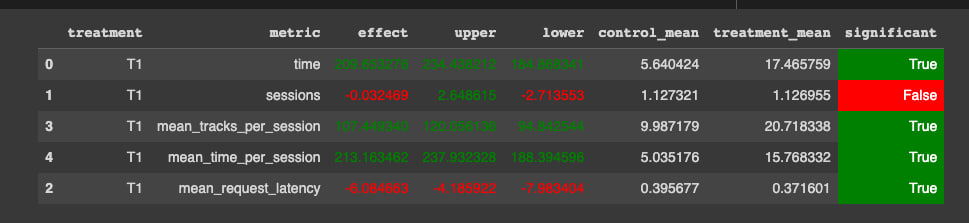

# Отчёт о выполнении Домашней работы

### i. Основная идея эксперимента
Для улучшения рекомендаций музыки и повышения метрики `mean_time_per_session` было сделано следующее:

- Переобучен нейросетевой рекомендатор на тех же данных, но с большей размерностью эмбединга (идея была в том, что удасться лучше хранить контекст). Также было немного изменено деление на train/val/test. Создан файл с новыми рекомендациями - [ссылка](data/my_track_recs.json)
- Следующая идея была в том, чтобы использовать для треков, которые не были найдены в предыдщуем рекомендаторе не `Random`, а `TopPop`
- Также для улучшения рекомендаций реализовано сохранение истории прослушивания пользователя, с целью не рекомендовать то, что он уже слушал
- Так как предыдущий рекомендер (`Contextual`) рекомендовал на основе предыдущего трека, то он мог на трек, который не понравился рекомендовать что-то, что тоже не понравится. Было сделано мини-удержание, то есть рекомендация на основе первого выбранного, пользователем трека. (Первоначально пытался выбирать треки, которые были с самой большой оценкой среди всей сессии, но там стат значимого результата не получил) 

### ii. Детали:
Для реализации было создано две глобальных переменных - `favfavourite_song` (для сохранения выбранного трека) и `listened` (для сохранения прослушанных во время сессии треков). Также в конце пользовательской сессии было сделана очистка данных о первом выбранном треке и историю прослушивания. 

Для чистоты эксперимента были изменены конфиги, чтобы старый нейросетевой рекомендер использовал старые данные, а мой собственный рекомендер использовал мои данные. 

Ноутбук с обучением модели - [RecSysHW.ipynb](RecSysHW.ipynb)

В файле `data.json` представлены логи сервиса с проведением А/Б тестирования.

### iii. Результаты

# Инструкция запуска

Для запуска контейнера из директории `botify` использовать команду - `docker-compose up -d --build`. И команду `curl http://localhost:5000/` - для проверки статуса нашего сервиса.

Для запуска симулятора поведения пользователя необходимо из директории `sim` вызвать команду `python sim/run.py --episodes 2500 --config config/env.yml single --recommender remote --seed 424242`, до этого установив необходимые зависимости в виртуального окружения `Python 3.7`.
